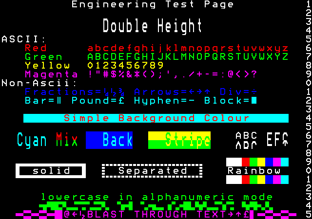
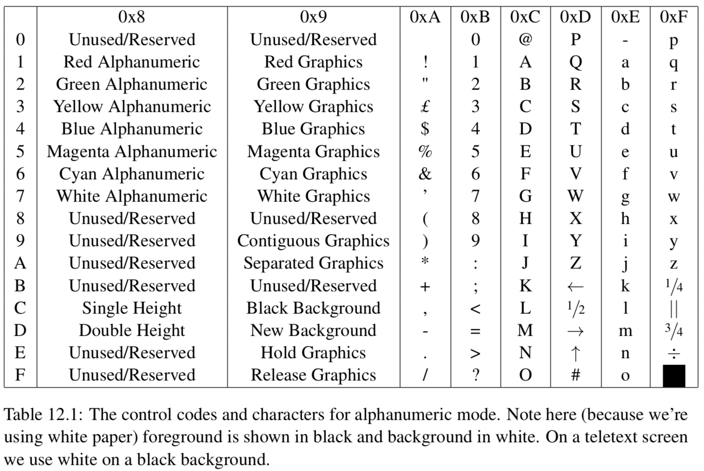
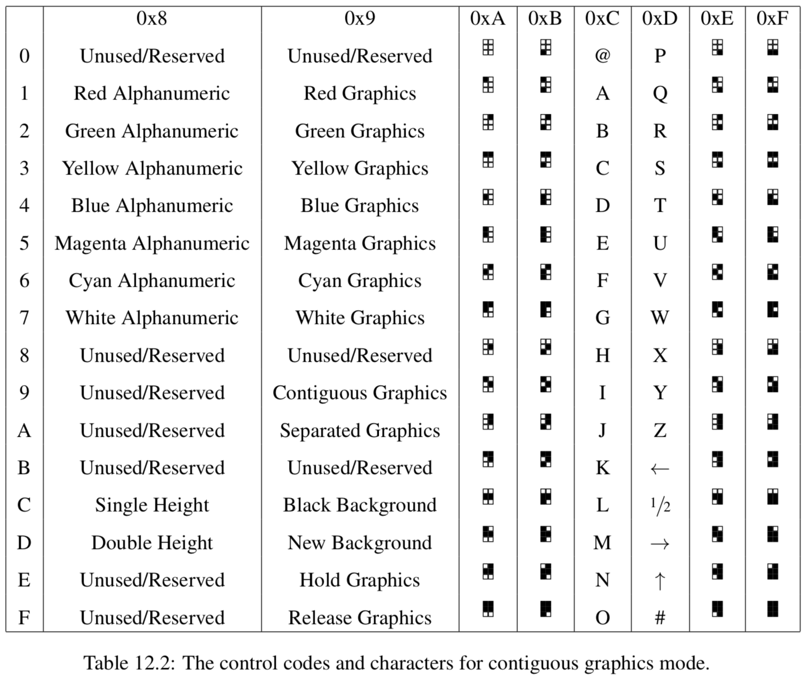
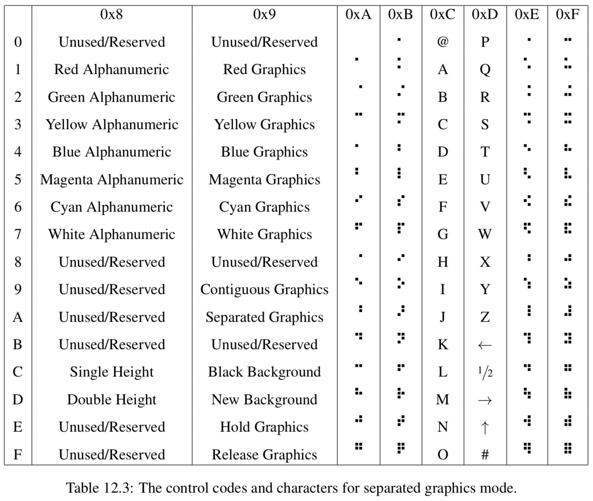

# Teletext Rendering System
Implementation of the teletext rendering system in C.  

In the early 1970s, Phillips Labs began work on transmitting digital information across the television network. The aim was to provide up-to-date news and weather information via a television set. This system was trialled first by the BBC in a system that eventually became known as “Ceefax” and then on other independant British terrestrial stations as “Oracle”. A very
similar system was implemented on the BBC microcomputer, known as Mode 7. This project, inspired by such teletext systems, will allow a 40 × 25 (1000) character file to be rendered to the screen, using similar control codes.  

## Structure
There are 4 main components:
1. Tokenizer: Takes as input a Teletext file, identifies valid tokens and categorizes them in basic types. Then it produces a TokenStream.  

2. Decoder: Consists of a set of functions that decode the control codes and return teletext modes, colors etc.  

3. Translator: It’s where the most work happens. It takes a TokenStream as an input and returns a Teletext structure. The translator is implemented as a simple State Machine. Each token produces an output depending on the current state of the translator and if it’s a control code it defines the next state.  

4. Renderer: SDL is used for graphics. The renderer takes as an input a Teletext structure and draws it on the screen.  Clear boundaries are kept between the main teletext functionality and the renderer. Any other graphics libraries can be implemented.  

## Testing and Debugging
Attention:  Do not rely on visual evaluation. Run the tests in the /testing folder after making changes to the code. Tests are also include for details like cached block graphics.   

Run VALGRIND and GDB to check for memory leaks and errors.  

Each token and each Teletext “Pixel” has it’s own debug info( ex. Position, line) along with other information, so results can be evaluated results without enabling SDL.  

The code is clearly separated into units that can be tested and evaluated independently. Every unit includes tests, for example the Tokenizer, the Sixels functionality and the Translator logic. The tests evaluate various switching cases and edge cases using assert.h. Examples include single/double height mode with or without neighbors, various hold graphics cases to test that hold mode works correctly and it caches the correct block graphic. All these tests can be found at teletext_test.c along with descriptions for each case tested.   

## Libraries
* SDL C library - used for graphics  

## Control Codes

## Author

**Evan Lalopoulos** - [evanlal](https://github.com/evanlal)

## License
Written by Evan Lalopoulos <evan.lalopoulos.2017@my.bristol.ac.uk>    
Copyright (C) 2017 - All rights reserved.  
Unauthorized copying is strictly prohibited.  
